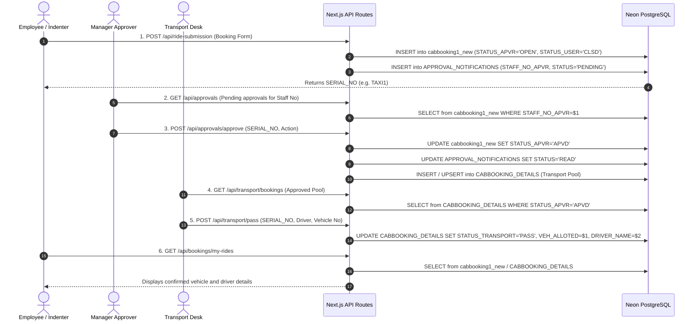

# BHEL Transport Management System - Architecture Blueprint

## 1. System Overview
The **BHEL Transport Management System (BTMS)** is an enterprise transportation scheduling, requisition, and fleet management platform engineered for Bharat Heavy Electricals Limited (BHEL).

The platform serves three operational roles:
- **Employee (Indenter / Passenger)**: Submit taxi requests, view ride history, monitor manager approvals, track allotting statuses, and download confirmation responses.
- **Manager (Approver)**: Review subordinate ride requisitions, inspect trip details, approve/reject requisitions, and trigger transport pool notifications.
- **Transport Desk (Dispatcher)**: Process approved bookings, allot vehicles/drivers, issue gate passes, and manage fleet logistics.

---

## 2. Technology Stack

| Layer | Technology | Purpose |
|---|---|---|
| **Frontend Framework** | Next.js 16.3.4 (App Router & Turbopack) | Server & Client component rendering, SSR/SSG |
| **Language** | TypeScript 5 | Strict static typing and interface contracts |
| **UI Components** | Radix UI Primitives + Tailwind CSS 3.4 | Accessible, themeable UI components (Shadcn pattern) |
| **Icons & Charts** | Lucide React + Recharts | Visual iconography and dashboard analytics |
| **Database** | Neon Serverless PostgreSQL (pg 8.23) | Acid transactions, connection pooling, cloud durability |
| **Authentication & Security** | Jose / JWT / BcryptJS | Multi-tier session cookies, role verification, password hashing |
| **Testing** | Node.js Test Suites + Playwright | Unit, database invariant, API smoke, and E2E testing |

---

## 3. Directory Structure Blueprint

```
bhel/
├── app/                               # Next.js App Router root
│   ├── api/                           # REST API Route Handlers
│   │   ├── approvals/                 # Manager approval & notification triggers
│   │   ├── auth/                      # Unified login, logout, session verification
│   │   ├── bookings/                  # User ride retrieval and status tracking
│   │   ├── db/                        # Database health probe
│   │   ├── debug/                     # Development diagnostic endpoints
│   │   ├── demo/                      # Demo seed & setup helpers
│   │   ├── download-response/         # Gate pass & booking response PDF/HTML downloads
│   │   ├── manager/                   # Manager notifications & sync to transport pool
│   │   ├── profile/                   # Employee profile fetching
│   │   ├── ride-submission/           # Main booking intake handler
│   │   └── transport/                 # Transport desk booking review & pass dispatch
│   ├── dashboard/                     # Employee Portal Page & Client Components
│   ├── manager-dashboard/             # Manager Portal Page & Approval Dashboard
│   ├── transport-dashboard/           # Transport Desk Operations Portal
│   ├── login/                         # Unified & Role-specific Login Routes
│   ├── layout.tsx                     # App layout (Providers, Toaster, Navigation)
│   ├── page.tsx                       # Root landing & booking request portal
│   └── globals.css                    # Tailwind design system CSS variables
│
├── components/                        # Shared & Domain-specific UI Components
│   ├── admin/                         # Admin portal components & health cards
│   ├── auth/                          # Authentication forms & login widgets
│   ├── layout/                        # Global header, sidebar, navigation
│   ├── loading/                       # Skeleton placeholders for data tables/cards
│   ├── ui/                            # Tailored Shadcn UI primitives
│   ├── ApprovalTable.tsx              # Interactive approval data table
│   ├── BookingDetailsModal.tsx        # Deep booking inspect modal
│   └── ErrorBoundary.tsx              # React component error boundary
│
├── lib/                               # Core Business Logic & Infrastructure
│   ├── database.ts                    # PostgreSQL connection pooling, retry, transactions
│   ├── secure-auth.ts                 # Bcrypt hashing, JWT generation, cookie management
│   ├── auth.ts                        # Unified database/auth facade
│   ├── form-validation.ts             # Zod and custom form validation schemas
│   ├── utils.ts                       # ClassName merging and styling helpers
│   ├── logger.ts                      # Secure logger and correlation IDs
│   └── server/                        # Server-only data access utilities
│
├── hooks/                             # Custom React Hooks
│   ├── use-auth.ts                    # Client-side auth state hook
│   ├── use-mobile.tsx                 # Viewport responsive breakpoint hook
│   └── use-toast.ts                   # Toast notification hook
│
├── types/                             # TypeScript Interface & Type Definitions
│   └── index.ts                       # Core User, RideBooking, EmpProfile definitions
│
├── scripts/neon/                      # Database Migration & Operational Scripts
│   ├── 01-init-schema.sql             # Full DDL schema creation script
│   ├── 02-seed-data.sql               # Seed accounts and master view data
│   ├── migrate-schema.js              # Schema DDL execution runner
│   ├── seed-data.js                   # Seed data execution runner
│   ├── test-connection.js             # Neon connectivity & object presence tester
│   ├── test-crud-flows.js             # 6-step business lifecycle verification
│   ├── verify-sequences.js            # Sequence alignment and sync tool
│   └── reconcile-data.js              # Data reconciliation & synchronization
│
├── tests/                             # Enterprise Testing Hierarchy
│   ├── unit/                          # Pure unit tests (Security, validation)
│   ├── database/                      # PostgreSQL invariant & rollback tests
│   ├── integration/                   # API smoke & contract tests
│   ├── helpers/                       # Test utilities, assertion engine, reporting
│   └── run-all-tests.js               # Master test runner
│
├── docs/                              # Comprehensive Documentation Suite
│   ├── ARCHITECTURE.md                # System design & architecture blueprint
│   ├── DATABASE.md                    # Database ERD, schemas, and sequence guide
│   ├── SECURITY.md                    # Security posture, RBAC, and session controls
│   ├── TESTING.md                     # Testing strategy and execution runbook
│   ├── DEPLOYMENT.md                  # Deployment, environment, and operations
│   ├── API.md                         # Complete API endpoint catalog
│   └── NEON_MIGRATION_CERTIFICATION.md# Database migration certification report
│
├── public/                            # Static Web Assets & Progressive Web App (PWA)
│   ├── logo.png                       # BHEL enterprise logo
│   ├── taxilogo2.jpg                  # Application branding badge
│   ├── manifest.json                  # PWA web app manifest
│   └── sw.js                          # Service worker cache script
│
├── .env.example                       # Documented environment variable template
├── .gitignore                         # Git exclusion rules
├── eslint.config.js                   # Consolidated flat ESLint configuration
├── proxy.ts                           # Next.js 16 authentication & route protection proxy
├── next.config.js                     # Next.js server configuration
├── package.json                       # NPM package manifest with operational scripts
├── tailwind.config.ts                 # Tailwind design tokens and themes
└── tsconfig.json                      # TypeScript compiler configuration & path aliases
```

---

## 4. Role-Based Workflow Architecture


